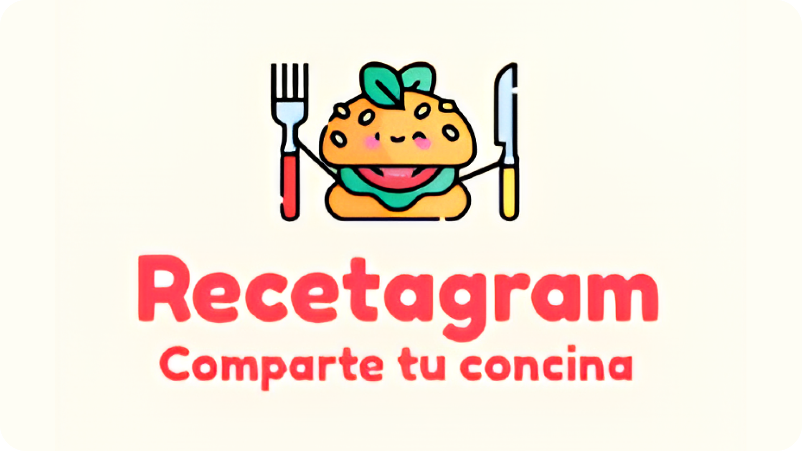

# Recetagram

---

###### Por ➡️ Natalia Cortés

---

## 📌 Idea de la Aplicación

Recetagram es una comunidad en línea diseñada para apasionados de la cocina que desean compartir sus creaciones culinarias, conocimientos y experiencias con otros entusiastas. Su propósito es fomentar la interacción, la inspiración y el aprendizaje a través de una plataforma intuitiva donde chefs aficionados y profesionales pueden conectar y explorar nuevas recetas.

## 🎯 Audiencia Objetivo

Recetagram está dirigida a:

- Aficionados a la cocina que buscan aprender nuevas recetas y técnicas.
- Chefs profesionales que desean compartir su conocimiento y obtener reconocimiento.
- Food bloggers e influencers que buscan una plataforma para expandir su comunidad.
- Personas interesadas en descubrir recetas de diversas culturas y tradiciones gastronómicas.

## 📊 Análisis de Mercado

Existen plataformas similares en el mercado, como:

- **Cookpad**: Permite compartir recetas, pero carece de un enfoque social fuerte.
- **Tasty (Buzzfeed)**: Ofrece recetas en video, pero sin interacción entre usuarios.
- **Pinterest**: Contiene muchas recetas, pero no está centrado exclusivamente en la comunidad culinaria.

### 🔥 Valor añadido de Recetagram:

- **Interacción social**: Sistema de likes, comentarios y compartir recetas.
- **Perfiles personalizados**: Cada usuario puede destacar sus especialidades culinarias.
- **Sistema de roles**: Moderadores, administradores y usuarios verificados.
- **Recetas destacadas y estadísticas**: Análisis de impacto y tendencias dentro de la comunidad.
- **Eventos y logros**: Participación en desafíos y reconocimientos dentro de la plataforma.
- **404 page**: Un 404 page interactivo con un juego que enganchará a más de 1.
- **Juegos y eastereggs**: Truquitos, jueguitos ocultos y secretillos para descubrir.

## 🚀 Funcionalidades Clave

1. **Explorar Recetas**: Descubrir nuevas recetas de diferentes estilos y culturas.
2. **Compartir Creaciones**: Publicar recetas con imágenes, ingredientes y pasos detallados.
3. **Interacción Social**: Dar "me gusta", comentar y compartir recetas.
4. **Perfiles Personalizados**: Creación de perfiles con logros y especialidades culinarias.
5. **Roles y Moderación**: Distintos niveles de acceso para administración y curación de contenido.
6. **Búsqueda y Categorización**: Encontrar recetas según ingredientes, tipo de comida o dificultad.
7. **Mensajería Privada**: Comunicación entre miembros de la comunidad.
8. **Eventos y Desafíos**: Participación en concursos y retos culinarios.
9. **Sistema de Notificaciones**: Alertas sobre comentarios, interacciones y nuevas recetas.
10. **Integración de Videos**: Posibilidad de subir y compartir videos de recetas.

## 🛠️ Tecnologías a Utilizar

| Tecnología                    | Motivo                                                       |
| ----------------------------- | ------------------------------------------------------------ |
| **Frontend**                  |
| Vue                           | Framework rápido y eficiente para desarrollo web interactivo |
| Tailwind CSS                  | Permite un diseño moderno y responsivo                       |
| **Backend**                   |
| Spring Boot                   | Framework robusto y escalable para el backend                |
| MongoDB                       | Base de datos flexible y escalable                           |
| **Autenticación y Seguridad** |
| JWT                           | Seguridad en las sesiones                                    |
| **Hosting y Despliegue**      |
| Vercel / Netlify              | Hosting rápido para frontend                                 |

## 🎯 Roadmap de Desarrollo

### Web mínimos

- [x] **Diseñar wireframe**
- [x] **Diseñar maqueta**
- [x] **Hacer README**
- [x] **Implementar Sistema de "Likes"**
- [x] **Implementar Sistema de Compartir**
- [x] **Diseño Responsive**
- [x] **Implementar Sistema de Login**
- [x] **Implementar Sistema de Registro**
- [x] **Implementar Sistema de alertas**
- [x] **Implementar Sistema de Temas**
- [x] **Integrar maqueta a código**
- [x] **Implementar Sistema de Comentarios**
- [x] **Contador de Comentarios en Posts**
- [x] **Modal de Comentarios con Cierre al Click Fuera**
- [x] **Implementar Perfiles por Cada Persona**
- [ ] **Sistema de Notificaciones de usuario (likes, comentarios en post, nuevas subidas...)**
- [ ] **Búsqueda de Recetas (filtros)**
- [ ] **Edición del perfil del usuario**
- [ ] **Funcionalidades de Edición de Recetas en los posts mediante el perfil**
- [ ] **Integración de modo oscuro/claro**
- [ ] **Integración de temas personalizados**

### Api mínimos

- [x] **Implementar roles de admins 🍴**
- [x] **Implementar roles de moderador 🍽️**
- [x] **Implementar roles de verificado ✅**
- [x] **Implementar Comentarios en los posts**
- [x] **CRUD completo de comentarios**
- [ ] **Implementar Sistema de Aprobación de Publicaciones**
- [ ] **Categorización de Recetas**
- [ ] **Sistema de Mensajería Privada**
- [ ] **Notificaciones de usuario (likes, comentarios en post, nuevas subidas...)**
- [ ] **Estadísticas de Recetas**
- [ ] **Recetas Destacadas**
- [ ] **Integración de Videos**
- [ ] **Eventos de Cocina**
- [ ] **Logros**

---

### Opcionales

- [x] **Publicar en redes**
- [x] **Añadir botón de donaciones**

## 💖 Apartado de Donaciones

---

¡Únete a Recetagram y descubre un universo de sabores e historias culinarias! 🍽️🔥
